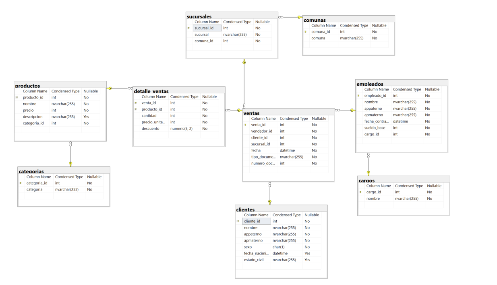
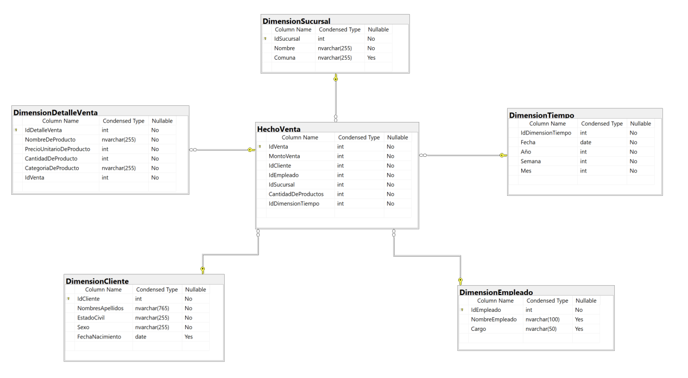

Inteligencia de Negocios

# Evaluación 2

## Herramientas 

|||
|--|--|
|SQL Server Management Studio (SSMS) |Cliente de base de datos para montar y diseñar los modelos dimensionales propuestos para DW|
|Visual Studio Community - DataTools (Integration Services - Analysis Services)|Creación de ETL|

## Ojetivo

* Montar base de datos 
* Analizar modelo
* Definir KPI's
* Modelamiento Dimensional
* Diseñar base de datos DW
* Construir ETL
* Validar ETL

### Montar base de datos

Utilzar SQL Server para levantar base de datos del caso

### Analizar modelo de base de dato

Identificar tablas, tipos de datos, relaciones y cantidad de registros, para lograr este objetivo. Creamos un diseño utilizando SQL Server Management Studio (SSMS)

- [Albarran SQL - CREAR BASE DE DATOS](01-Albarran.sql)
- [Albarran SQL - INSERTAR DATOS](02-Albarran.sql)

### Definir KPI's

Identificar indicadores claves que aportarán valor a la organización para tomar decisiones 

|Área|Objetivo|Nombre del KPI|Formula|Fuente de Información|Frecuencia de Medición|Unidad de Medida|Medición|Meta|Optimo|Tolerable|Deficiente|
|--|--|--|--|--|--|--|--|--|--|--|--|
|Clientes|Medir cantidad de clientes activos mensualmente|cantidad de ventas por cliente|total venta/clientes unicos|base de datos de venta|Mensual|unidad de venta|0|>= 2|>= 1|=1|=0|
|empleado|Medir cantidad de ventas por empleado|cantidad de ventas por empleado|cantidad de ventas por empleado|base de datos de de ventas|Mensual|productos vendidos|0|>=3|>=2|=1|=0|
|clientes|Medir cantidad clientes nuevos mensual|cantidad clientes nuevos|total cliente mes anterior - total clientes mes actual|base de datos de cliente|Mensual|unidad de cliente unico|0|>=10|>= 5|>=3|<=1|
|empleado|Medir tiempo de permanecia de empleados | fecha contrato clientes menos fecha actual  | fecha contrato cliente-fecha actual |base de datos de empleados|Mensual|unidad de cliente unico|dia|>=730|>= 365|>=182|<=91|
|producto|Medir cantidad de  productos vendidos| productos vendidos|cantidad de stock de producto - cantidad producto vendido|base de datos de producto|Mensual|unidad de producto|0|>=10|>= 5|>=3|<=1|

### Modelamiento Dimensional

||||
|--|--|--|
||Elegir el proceso de negocio|Proceso de Venta|
||Establecer el nivel de granularidad|Modelo Estrella, utilizamos una tabla centrar y las dimensiones representadas radialmente|
||Elegir las dimensiones|Las tablas que usamos como dimensiones corresponden a: Empleado, Producto, Reporte|
||Identificar medidas y tablas de hecho||

- [AlbarranDW SQL - CREAR BASE DE DATOS](03-AlbarranDW.sql)
- [AlbarranDW SQL - INSERTAR DE DATOS](04-AlbarranDW.sql)

### Construir ETL

Utilizar herramienta Visual Studio para construir Proceso ETL

### Validar ETL

Verificar que el ETL construido funcione, esto quiere decir que se debe verificar que los datos son transportados desde la base de dato de origen a la base de datos de destino.

