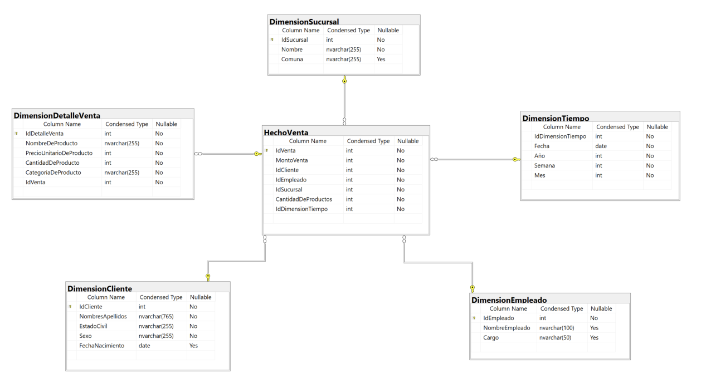

# Evaluación 1 - BIY6121

## Introducción

La Mueblería Albarrán, es una empresa considerada innovadora en el rubro de la venta de muebles, dada su vanguardia y su amplia visión de mercado. En los últimos años ha crecido rápidamente, por esta razón su propietario ha decidido incorporar Inteligencia de Negocios a su compañía. El equipo escogido para desarrollar esta iniciativa va a permitir a los encargados tomar las mejores decisiones necesarias para lograr que la organización siga en el buen camino. 

## Desarrollo

Para el desarrollo del proyecto, en primer lugar, asignamos responsabilidades a los integrantes del equipo.  En segundo lugar, identificamos y declaramos los indicadores de desempeño que permitirán identificar oportunidades de mejora en algunos de los procesos de la organización. En tercer lugar, analizamos el modelo relacional de la base de datos para identificar las tablas y atributos que aportan valor para el proyecto. A continuación procedemos a describir las cuatro dimensiones que se consideran en el modelo de Kimball 

### Elegir el proceso de negocio.

El proceso de negocio que hemos seleccionado corresponde a Ventas.

### Establecer el nivel de granularidad. 

La granularidad que elegimos para desarrollar el proyecto corresponde. Modelo Estrella

### Elegir las dimensiones. 

Las dimensiones que seleccionamos para relacionar en nuestro modelo corresponden a las siguientes. 
-	Detalle de Venta
-	Clientes
-	Calendarios de Ventas (derivada de Ventas)
-	Empleados

### Identificar medidas o métricas y la tabla hecho

#### Modelo Dimensional

## Conclusiones

El modelado dimensional de Kimball permite a los usuarios construir varios esquemas en estrella para satisfacer diversas necesidades de generación de informes. La ventaja del esquema en estrella es que las consultas de tablas dimensionales pequeñas se ejecutan instantáneamente.
