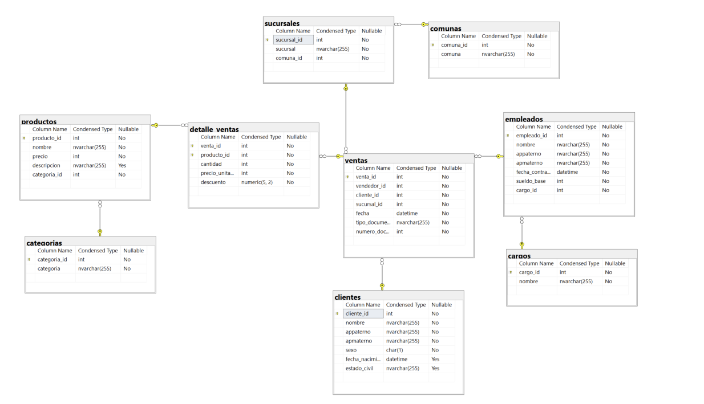
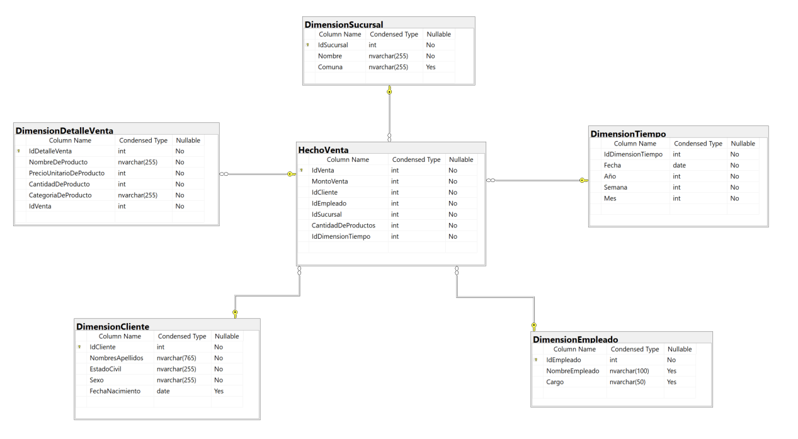

# Evaluación 2 - BIY6121

## Herramientas 

- [Visual Studio 2022](https://visualstudio.microsoft.com/es/downloads/)  
- [SQL Server 2022 Developer](https://www.microsoft.com/es-cl/sql-server/sql-server-downloads)
- [SQL Server Management Studio (SSMS)](https://learn.microsoft.com/es-es/sql/ssms/download-sql-server-management-studio-ssms?view=sql-server-ver16)
- [SQL Server Integration Services Projects 2022](https://marketplace.visualstudio.com/items?itemName=SSIS.MicrosoftDataToolsIntegrationServices)
- [Microsoft Analysis Services Projects 2022](https://marketplace.visualstudio.com/items?itemName=ProBITools.MicrosoftAnalysisServicesModelingProjects2022)

## Ojetivos

* Restaurar Base de Datos 
* Analizar Modelo
* Definir KPI's
* Modelamiento Dimensional
* Diseñar Base de Datos DW
* Construir ETL
* Validar ETL
* Construir CUBO
* Validar CUBO

## Diagrama de Base de Datos

## Diagrama de Base de Datos DW

